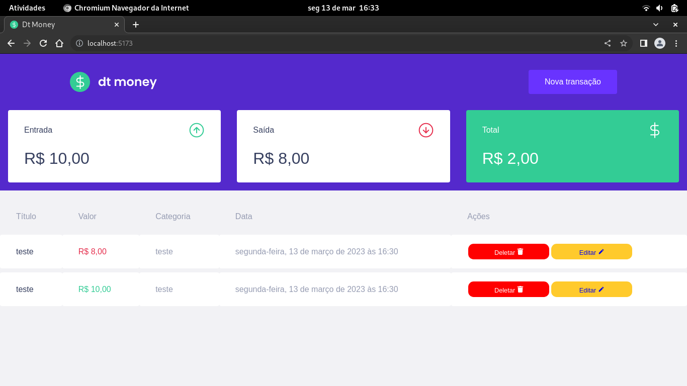

# Dt Money



## Tecnologias

Este projeto foi feito utilizando as seguintes tecnologias:

- [React](https://reactjs.org/)
- [Typescript](https://www.typescriptlang.org/)
- [Axios](https://github.com/axios/axios)
- [React Modal](https://github.com/reactjs/react-modal)
- [Styled Components](https://github.com/styled-components/styled-components)
- [Vite](https://vitejs.dev/)
- [Django Rest Framework](https://www.django-rest-framework.org/)

## Executando

```bash
# Acesse a pasta do projeto
$ cd dtmoney
```

```bash
# Baixe as dependendências
$ yarn
```

```bash
# Execute
$ yarn run dev
```

Acesse <http://localhost:5173> para ver o resultado.

## Licença

Este projeto está sob a licença [MIT](LICENSE.md).
